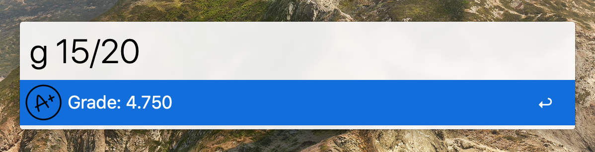

# Calculate grades

Easily calculate grades just by entering the number of points and the total number of points.
The grades are calculated with the following formula:

```
achieved_points / total_points * 5 + 1
```

### Example usage


